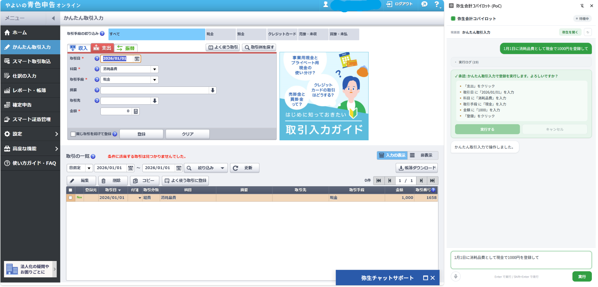

# Yayoi Copilot — 弥生会計コパイロット

自然言語の指示で「弥生会計オンライン（やよいの青色申告 オンライン）」を操作する **Chrome拡張機能**。
サイドパネルに「6月の損益レポートを開いて」「5月30日 消耗品費を三井住友カードで6800円 登録して」のように
入力（または音声）すると、拡張が弥生の画面を操作して報告・入力まで行う。

ユーザー自身の本物のChrome上で動くため、Akamai BotManager のbot検知もログイン（MFA含む）も通常どおり通る。



> 「1月1日に消耗品費として現金で1000円を登録して」と指示すると、各欄を自動入力し、
> **登録前に内容を提示して承認を求める**（確認ゲート）。承認して初めて登録される。

## できること

- **画面を開いて報告** — レポート・帳簿・各種メニューを開き、内容を要約して報告（読み取り系）
- **期間を指定してレポート表示** — 「6月」「先月」「1/1〜3/31」などを解釈して期間欄に自動セット
- **かんたん取引入力で登録** — 指示文から日付・科目・取引手段・金額などを構造化し、決定的に入力（書き込み系）
- **音声入力** — マイクボタンで話した内容を指示欄に文字起こし（Chrome内蔵の音声認識）
- **確認ゲート** — 登録・保存・削除などデータを変える操作は、実行前に内容を提示して承認を求める

## アーキテクチャ

```
┌──────────────── ユーザーの Chrome ────────────────┐
│  弥生会計のタブ          サイドパネル（拡張UI）   │
│  （操作対象）            ・指示入力 / 音声入力     │
│                          ・実行ログ / 確認ゲート  │
│                                                  │
│  background.js（サービスワーカー）= エージェント  │
│   1. レシピに一致すれば決定的に操作（recipes.js） │
│   2. 判断が要る所はバックエンドにClaude問い合わせ │
│   3. chrome.debugger で trusted なクリック/入力   │
│   …done まで繰り返す                             │
└────────────────────────┬─────────────────────────┘
                         │ HTTP (localhost:8000)
                         ▼
┌──────────── Python バックエンド ─────────────────┐
│  FastAPI = Claudeプロキシ（鍵を拡張に渡さない）   │
│  POST /api/agent/next          → 次の1手を決定    │
│  POST /api/agent/extract-dealing → 取引項目を抽出 │
└──────────────────────────────────────────────────┘
```

- **操作の実体は拡張機能**（`chrome.debugger` の Input イベント＝OS由来と同等の trusted な操作）。
- **バックエンドは軽量プロキシ**。`ANTHROPIC_API_KEY` を保持し、Claude への問い合わせのみ代行する。拡張は鍵を一切持たない。
- ログインは初回・以降ともユーザーが普段どおり手動で行う（認証情報の自動入力はしない）。
- **決定的レシピ優先。** 安定URL・ラベル基点の操作で確実に動かし、判断が要る所だけAIに委ねる。

## ディレクトリ構成

```
yayoi-copilot/
├── extension/                 # Chrome拡張（MV3）
│   ├── manifest.json
│   ├── sidepanel.html / .js   # サイドパネルUI（指示入力・音声・ログ・確認）
│   ├── permission.html / .js  # マイク許可用ページ
│   ├── background.js          # エージェントループ（抽出→問い合わせ→操作）
│   ├── recipes.js             # 指示→決まった操作（レシピ）
│   ├── screens.js             # 画面モデル（現画面の特定・遷移）
│   └── dates.js               # 「6月」「先月」等の期間パース
├── backend/
│   ├── app.py                 # FastAPI（/api/agent/next, /extract-dealing, /health）
│   └── agent/
│       ├── ext_brain.py       # 次の操作を決めさせる頭脳
│       └── extract_dealing.py # 取引指示を構造化抽出
├── scripts/
│   └── start-backend.bat      # バックエンドのワンクリック起動（Windows）
├── docs/design.md
├── pyproject.toml             # Python依存（uv管理）
└── .env                       # ANTHROPIC_API_KEY（コミット禁止）
```

## セットアップ

### 前提
- Python 3.12+ / [uv](https://docs.astral.sh/uv/)
- Google Chrome

### 1. バックエンドを起動

```bash
cp .env.example .env          # ANTHROPIC_API_KEY を記入
uv sync
PYTHONPATH=backend uv run uvicorn backend.app:app --port 8000
```

> **ワンクリック起動（Windows）:** 毎回ターミナルを開きたくない場合は
> `弥生コパイロット起動.bat`（= `scripts/start-backend.bat`）をダブルクリックするだけでバックエンドが立ち上がる。
> 使うときだけ起動し、閉じれば停止する（常駐しない）。

### 2. 拡張機能を読み込む

1. `chrome://extensions` を開き「デベロッパーモード」をON
2. 「パッケージ化されていない拡張機能を読み込む」→ `extension/` フォルダを選択
   - ※ WSLで開発している場合、`/home/...` のパスはWindows版Chromeから直接読めない。`extension/` をWindows側（例: `C:\Users\<user>\yayoi-copilot-extension`）にコピーしてそこを指定する
3. コードを変更したら `chrome://extensions` の更新（↻）ボタンで反映

### 3. 使う

1. やよいの青色申告オンラインにログイン
2. ツールバーの拡張アイコンをクリック → サイドパネルが開く
3. 弥生のタブをアクティブにして指示を入力 → 「実行」（Enterでも実行）
   - 読み取り例:「仕訳帳を開いて最近の仕訳を5件報告して」「6月の損益レポートを開いて」
   - 登録例:「5月30日 消耗品費を三井住友のクレジットカードで6800円 登録して」
     → 各欄に入力後、**確認ゲート**で内容を提示。承認して初めて登録される
4. **音声入力**: 指示欄の左のマイクボタンを押して話すと文字起こしされる
   - 初回はマイク許可が必要。ボタンを押すと許可用タブが開くので「許可」してから使う

> ⚠ 実行中は「拡張機能がこのブラウザをデバッグしています」という黄色いバーが出る（`chrome.debugger` を使うため）。閉じると操作が止まる。

## 設計上の原則

- **書き込み系は明示指示があるときだけ。** 読み取り・確認系はユーザーが指示しない限りデータの入力・変更・保存・削除を行わない（`ext_brain.py` のシステムプロンプトで制約）。書き込み操作は実行前に確認ゲートを通す。
- **鍵は拡張に渡さない。** `ANTHROPIC_API_KEY` はバックエンドのみが保持する。
- `.env` は絶対にコミットしない。

詳細は [docs/design.md](docs/design.md) を参照。
